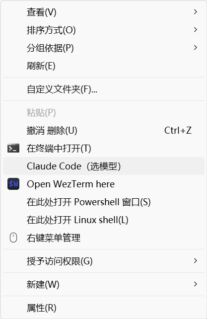
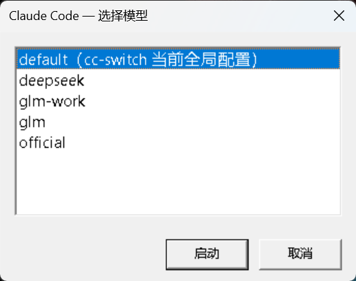

# cc-picker

Claude Code 多供应商启动器 —— 单文件安装，多终端各用各的模型。

> **跨平台**：Windows 提供完整体验（PowerShell：含资源管理器右键菜单、终端标签着色）；macOS / Linux 提供 Node 核心版（`ccp` 启动器、状态栏、Web 版 `ccm` 管理器），providers 配置两端互通。右键菜单与标签颜色为 Windows 专属功能。

在同一台机器上，一个终端用官方 Claude，一个用 GLM 个人号，一个用 GLM 公司号，一个用 DeepSeek……互不干扰。附带 GUI 配置管理器和账号识别状态栏。

## 界面预览

| `ccm` 管理器 | 新增供应商 |
|:---:|:---:|
|  |  |

| 资源管理器右键 | 选模型弹窗 |
|:---:|:---:|
|  |  |

状态栏常驻显示 `[账号] 模型 · 目录 · 上下文%`，终端标签按厂商着色（下图均为 GLM 会话）：

![状态栏：[glm] glm-5.3[1m] · cc-picker · ctx 0%](docs/statusline.png)


## 功能

| 能力 | 平台 | 说明 |
|---|:---:|---|
| `ccp` 命令 | 全平台 | 终端内菜单选供应商启动；熟练后 `ccp glm`、`ccp deepseek-work` 直达 |
| 资源管理器右键 | Windows | 任意目录右键 →「Claude Code（选模型）」→ 弹窗选择 → 新终端窗口在该目录启动 |
| `ccm` 管理器 | 全平台 | GUI 增删改供应商配置（cc-switch 式 JSON 直编）；GLM / DeepSeek / 官方一键预设；连通测试（发最小请求回报 HTTP 状态）；「默认」一键切换裸 `claude` 的供应商、「通用配置」直编全局 settings.json——可替代 cc-switch。Windows 为 WinForms 窗口，macOS/Linux 为浏览器页面（本地服务，仅监听 127.0.0.1） |
| 状态栏 | 全平台 | 常驻显示 `[账号] 模型 · 目录 · 上下文% · 5h% · 周%`，用 token 反查配置文件识别账号——连裸 `claude` 都能识别当前用的哪个号 |
| 限额显示 | 全平台 | 官方订阅读 Claude Code 自带的 rate_limits（免费实时）；GLM（5h/周）与 DeepSeek（余额）由后台查询缓存（`cc-usage`），状态栏只读缓存、过期才异步刷新，不阻塞 |
| tab 颜色 | Windows | 按厂商归组着色，与状态栏同色：GLM 系青 / DeepSeek 系蓝 / 官方绿 / 其他黄；标题启动后由 Claude Code 接管（会话/任务状态，可用 `/rename` 命名） |

Windows 支持 Git Bash 和 PowerShell 7 的 `ccp` / `ccm` 命令；macOS / Linux 装入 bash / zsh。

## 快速开始

**Windows**（前置：已装 Claude Code；建议装 PowerShell 7 与 Windows Terminal；Git Bash 可选）：

```powershell
# 1. 安装（幂等，可重复执行）
pwsh -ExecutionPolicy Bypass -File cc-setup.ps1

# 2. 打开管理器，贴入各供应商 token（或点预设再填 token）
ccm

# 3. 新开终端
ccp           # 菜单选择
ccp glm       # 直达某个配置
```

安装包会部署：`~/.claude/cc-launch.ps1`（右键启动器）、`cc-manager.ps1`（管理器）、`cc-statusline.ps1`（状态栏）、`cc-usage.ps1`（限额/余额查询）、`providers/*.json`（配置模板）、右键菜单注册、`ccp`/`ccm` 命令、settings.json 的 `statusLine`。

**macOS / Linux**（前置：已装 Claude Code；Node 18+，装 Claude Code 时通常已具备）：

```bash
# 1. 安装——npm 全局装（推荐）
npm install -g cc-picker
cc-picker install
#    或免安装一次跑：npx cc-picker install
#    或克隆本仓库后：bash install.sh

# 2. 打开管理器（本地 Web 页面，自动弹浏览器），贴入各供应商 token
ccm

# 3. 新开终端
ccp           # 菜单选择
ccp glm       # 直达某个配置
```

安装会部署：`~/.claude/ccp.js`（启动器）、`ccm.js` + `ccm-page.html`（Web 管理器）、`cc-statusline.js`（状态栏）、`cc-usage.js`（限额/余额查询）、`providers/*.json`（配置模板）、bash/zsh 的 `ccp`/`ccm` 函数、settings.json 的 `statusLine`。npm 全局装的用户还有 `ccp`/`ccm`/`cc-picker` 全局命令（维护：`cc-picker install | uninstall | status`）；运行时都在 `~/.claude` 稳定路径，换 node 版本或卸载 npm 包不影响已装好的部分。

## 工作原理

一切归结为一条命令：

```
claude --settings "C:\Users\you\.claude\providers\glm.json"
```

- `--settings` 属于命令行参数层，优先级高于用户级 `~/.claude/settings.json`，且与其**分层合并**——provider 文件里写的键覆盖全局，没写的键继续继承（全局的行为开关不受影响）。
- **为什么不用 shell 环境变量**（`ANTHROPIC_BASE_URL=xxx claude`）？因为 settings 文件的 `env` 块在启动时会把同名变量写回进程环境、覆盖 shell 传入值——只要全局配置里有 `ANTHROPIC_BASE_URL`，环境变量方案就失效。`--settings` 是唯一可靠的按进程覆盖方式。
- 每个进程启动时各读各的参数，多个终端互不干扰——这就是"一个窗口官方、一个窗口 GLM"的原理。

## 与 cc-switch 的关系

ccm 网页版自带「默认」按钮与「通用配置」编辑（macOS/Linux；Windows 版管理器暂无），**可以完全替代 cc-switch**：点卡片上的「默认」即把该供应商 env **合并**进全局 settings.json——非空键覆盖、空值键清除、未提及的键保留（settings.json 里手写的通用配置不丢），`statusLine` 等其他顶层键原样保留，裸 `claude` 随即生效。官方供应商（全空模板）即"清除全部供应商键、回官方"。

若两者并存：它们都会改写 settings.json，互相覆盖——用一边就别再用另一边。cc-switch 切换时会**整份重写** settings.json，只保留它"通用配置"里登记的顶层键——所以本项目写入的 `statusLine` 需要加进 cc-switch 的 Claude 通用配置，否则切换后状态栏会消失（安装脚本检测到 cc-switch 时会提醒）。

## 多机器迁移

1. 拷安装器到新机器执行（Windows：`cc-setup.ps1`；macOS/Linux：`install.sh` + `core/` 目录）；
2. 拷 `~/.claude/providers/*.json`（内含明文 token，注意传输渠道），或在新机器 `ccm` 重配。providers 格式两端通用。

token 不打进安装包，模板只有占位符。

## 卸载

**Windows**：

```powershell
# 右键菜单
Remove-Item 'HKCU:\Software\Classes\Directory\shell\ClaudePicker','HKCU:\Software\Classes\Directory\Background\shell\ClaudePicker' -Recurse
# 脚本与配置
Remove-Item ~\.claude\cc-launch.ps1, ~\.claude\cc-manager.ps1, ~\.claude\cc-statusline.ps1, ~\.claude\cc-usage.ps1, ~\.claude\cc-usage-cache.json, ~\.claude\cc-usage.last, ~\.claude\providers -Recurse
# settings.json 里删掉 statusLine 键；bashrc / pwsh profile 里删除 ">>> cc 多供应商启动器 >>>" 标记块
```

**macOS / Linux**：

```bash
bash uninstall.sh   # 清理脚本、缓存、shell 函数与 statusLine；providers（含 token）默认保留
```

## FAQ

- **状态栏消失了？** 装了 cc-switch 的话见上节——把 `statusLine` 段加进它的通用配置。
- **状态栏的账号名怎么来的？** 启动时用进程环境里的 `ANTHROPIC_AUTH_TOKEN` 逐一比对 `providers/*.json`，匹配即显示文件名；匹配不到则按 `ANTHROPIC_BASE_URL` 的主机名显示，两者皆空显示 `official`。
- **状态栏的限额（5h/周）哪来的？** 官方订阅：Claude Code 传给状态栏的 JSON 自带 `rate_limits`（5 小时 + 7 天窗口），直接显示。GLM：`cc-usage.ps1` 调智谱限额接口把结果缓存到 `~/.claude/cc-usage-cache.json`，状态栏读缓存显示，超过 10 分钟触发后台异步刷新（2 分钟防抖）——状态栏本身从不发网络请求，不会拖慢刷新。DeepSeek 显示账户余额（¥）。智谱接口另返回的 TIME_LIMIT 是附加产品（搜索/网页阅读等）的月度量，与模型调用限额无关，不显示；各账号有几档显示几档。
- **在盘符根目录右键报“目录不存在”？** 旧版本问题（`"C:\"` 的 `\"` 被解析成转义引号），已修复。

## 开发与发布

发布走 GitHub Actions：推一个 `v*` tag，[release.yml](.github/workflows/release.yml) 完成 版本校验 → 沙箱验证 → npm publish。

```bash
npm version patch        # 自动改 package.json + 打 tag + 提交（minor/major 同理）
git push --follow-tags
```

发布用 npm **trusted publishing**（OIDC）：仓库不存任何 npm token，GitHub 签发短时身份令牌完成发布，provenance 自动生成。**首次启用需要一次性配置**——

1. 用你的账号手动发布第一版：`npm login && npm publish`
2. npmjs.com 包页 → Settings → Trusted Publishers → 添加 `1e0zj/cc-picker`（workflow 填 `release.yml`）
3. 之后每次 `npm version` + 推 tag 即自动发布

（配置完成前推 tag 会在最后一步失败，无害，配好后重跑 workflow 即可。）

## License

[MIT](LICENSE)
