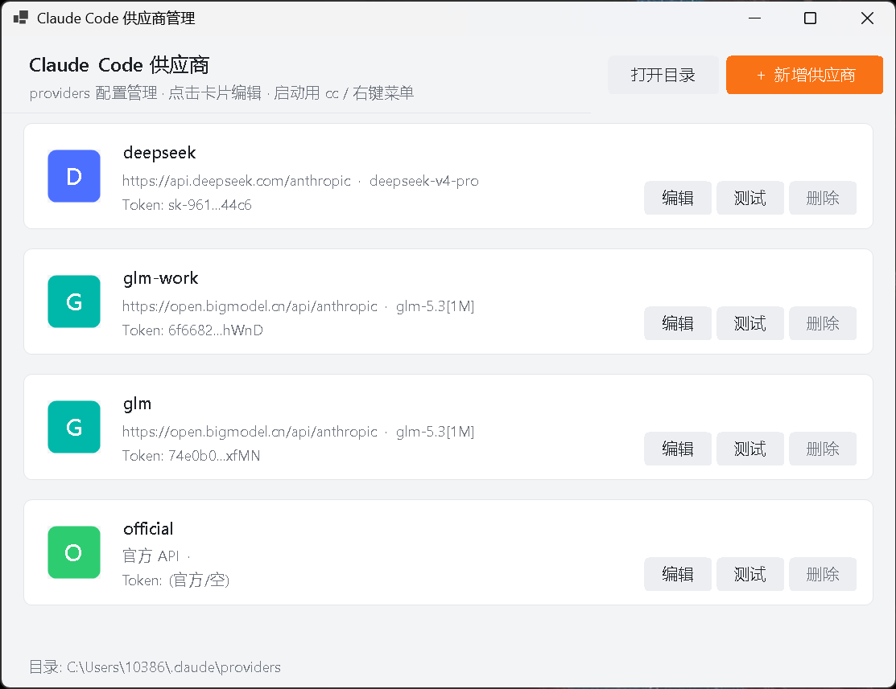
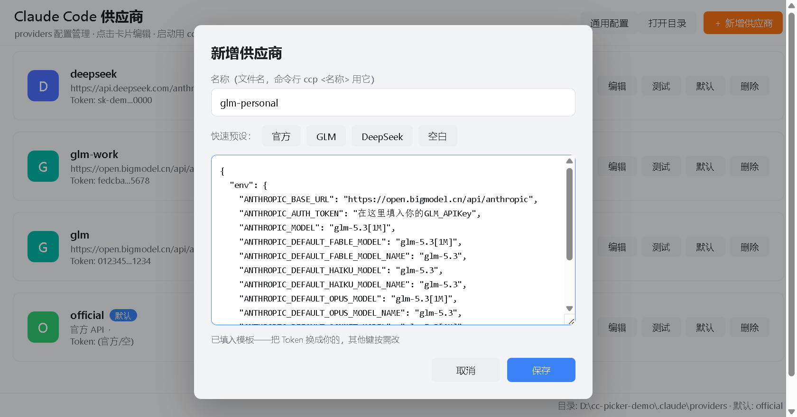

# cc-picker

[](https://www.npmjs.com/package/cc-picker)

Claude Code 多供应商启动器 —— 多开终端各用各的模型，当前用的哪个号、还剩多少量，状态栏一眼看清。

## 解决什么问题

日常用 Claude Code，大概率遇到过这两件事：

- **同时多开终端，想让每个终端用不同的模型。** cc-switch 做不到——它切换的是全局配置，所有终端一起跟着变。
- **订阅的厂商越来越多，切换麻烦还心里没底。** 每次都得去 cc-switch 切一下，切完还得 `/model` 确认当前终端用的到底是谁。

cc-picker 的做法很简洁：用 claude 启动参数 [`--settings`](#工作原理) 给每个进程指定不同厂商的配置文件——**各 Claude Code 进程用哪个厂商，启动那一刻就定了，互不干扰**。再配上自定义状态栏，`[账号] 模型 · 目录 · 上下文% · 限额` 常驻显示，用的是谁、还能用多少，不用猜。

于是日常就变成：一个终端跑官方、一个 GLM 个人号、一个 GLM 公司号、一个 DeepSeek 同时开工；熟练后 `ccp glm` 两个词直达，或者在任意目录右键 →「Claude Code（选模型）」。

> **跨平台**：Windows / macOS / Linux 跑同一套 Node 实现——`ccp` 启动器、状态栏、Web 版 `ccm` 管理器，providers 配置各平台通用。右键菜单 Windows 与 macOS 有，Linux 因为各文件管理器机制互不相同没有做。

## 界面预览

| `ccm` 管理器 | 新增供应商 |
|:---:|:---:|
|  |  |

状态栏常驻显示 `[账号] 模型 · 目录 · 上下文% · 限额`：

![状态栏：[glm] glm-5.3[1m] · cc-picker · ctx 0%](docs/statusline.png)

## 功能

| 能力 | 说明 |
|---|---|
| `ccp` 命令 | 终端内菜单选供应商启动；熟练后 `ccp glm`、`ccp deepseek-work` 直达 |
| `ccm` 管理器 | GUI 增删改供应商配置（cc-switch 式 JSON 直编）；卡片直接显示 Claude 官方/GLM 的 5 小时与 7 天限额、DeepSeek CNY 余额，支持 5 分钟缓存和单卡刷新；GLM / DeepSeek / 官方一键预设；连通测试；「默认」一键切换裸 `claude` 的供应商、「通用配置」直编全局 settings.json——可替代 cc-switch。浏览器页面，本地服务仅监听 127.0.0.1 |
| 状态栏 | 常驻显示 `[账号] 模型 · 目录 · 上下文% · 5h% · 周%`，用 token 反查配置文件识别账号——连裸 `claude` 都能识别当前用的哪个号 |
| 右键菜单 | Windows 资源管理器、macOS Finder 里右键文件夹 →「Claude Code（选模型）」→ 新终端窗口在该目录打开，选供应商启动；选择界面就是 `ccp` 的终端菜单。随安装一起装上 |
| 限额显示 | 状态栏里的官方订阅读 Claude Code 自带的 rate_limits；CCM 的官方订阅复用本机 Claude Code OAuth 登录查询。GLM（5h/周）与 DeepSeek（余额）由后台查询并缓存（`cc-usage`），查询失败会保留最后一次成功结果 |

## 快速开始

前置：已装 Claude Code；Node 18+（装 Claude Code 时通常已具备）。三个平台步骤相同：

```bash
# 1. 安装——npm 全局装（推荐）
npm install -g cc-picker
cc-picker install
#    或免安装一次跑：npx cc-picker install
#    或克隆本仓库后：bash install.sh

# 2. 打开管理器（本地 Web 页面，自动弹浏览器），贴入各供应商 token
ccm

# 3. 新开终端
ccp           # 菜单选择
ccp glm       # 直达某个配置
```

安装会部署到 `~/.claude`：`ccp.js`（启动器）、`ccm.js` + `ccm-page.html`（Web 管理器）、`cc-statusline.js`（状态栏）、`cc-usage.js`（限额/余额查询）、`cc-menu.js`（右键菜单装卸）、`providers/*.json`（配置模板），外加 bash / zsh 的 `ccp` / `ccm` 函数（Windows 走 Git Bash）与 settings.json 的 `statusLine` 键。

右键菜单也在其中——Windows 写 HKCU 注册表（不需要管理员），macOS 往 `~/Library/Services` 放一个快速操作。不想要就 `cc-picker install --no-menu`，或事后 `cc-picker menu uninstall`；反过来单独补装是 `cc-picker menu install`。

运行时都落在 `~/.claude` 这个稳定路径——换 node 版本、卸掉 npm 包都不影响已经装好的部分。npm 全局装的用户另有 `ccp` / `ccm` / `cc-picker` 三个命令，维护用 `cc-picker install | uninstall | status`。

## 更新

```bash
cc-picker update
```

它会去拉最新的 npm 包，把新版脚本刷进 `~/.claude`，并做旧版迁移：已装的右键菜单重写一遍注册表、还指向 `cc-statusline.ps1` 的 statusLine 换成 Node 版、删掉 PowerShell 时代部署的 `cc-*.ps1` 残留（`providers/*.json` 与用户自己的 settings.json 配置不碰）。等价的写法是直接 `npm install -g cc-picker@latest`——包的 postinstall 会做同样的脚本刷新，迁移则在下次 `cc-picker update` 时补上。

之所以需要这一步刷新：`~/.claude` 下跑的是安装时复制的副本（statusLine、shell 函数、右键菜单都写死指向那个稳定路径，换 node 版本或卸掉 npm 包都不受影响），而 npm 换包只换 `node_modules` 里的源文件。

`cc-picker status` 会逐个比对 `~/.claude` 里的脚本和当前包，不一致会直接点名。克隆仓库装的走 `git pull && bash install.sh`。

## 工作原理

一切归结为一条命令：

```
claude --settings ~/.claude/providers/glm.json
```

- `--settings` 属于命令行参数层，优先级高于用户级 `~/.claude/settings.json`，且与其**分层合并**——provider 文件里写的键覆盖全局，没写的键继续继承（全局的行为开关不受影响）。
- **为什么不用 shell 环境变量**（`ANTHROPIC_BASE_URL=xxx claude`）？因为 settings 文件的 `env` 块在启动时会把同名变量写回进程环境、覆盖 shell 传入值——只要全局配置里有 `ANTHROPIC_BASE_URL`，环境变量方案就失效。`--settings` 是唯一可靠的按进程覆盖方式。
- 每个进程启动时各读各的参数，多个终端互不干扰——这就是"一个窗口官方、一个窗口 GLM"的原理。

`ccp` 做的就是挑一个 provider 文件、把路径填进去；右键菜单做的是先切到你右键的那个目录，再把 `ccp` 拉起来。

## 与 cc-switch 的关系

ccm 自带「默认」按钮与「通用配置」编辑，**可以完全替代 cc-switch**：点卡片上的「默认」即把该供应商 env **合并**进全局 settings.json——非空键覆盖、空值键清除、未提及的键保留（settings.json 里手写的通用配置不丢），`statusLine` 等其他顶层键原样保留，裸 `claude` 随即生效。官方供应商（全空模板）即"清除全部供应商键、回官方"。

若两者并存：它们都会改写 settings.json，互相覆盖——用一边就别再用另一边。cc-switch 切换时会**整份重写** settings.json，只保留它"通用配置"里登记的顶层键——所以本项目写入的 `statusLine` 需要加进 cc-switch 的 Claude 通用配置，否则切换后状态栏会消失（安装脚本检测到 cc-switch 时会提醒）。

## 多机器迁移

1. 新机器上装一遍：`npm install -g cc-picker && cc-picker install`（或克隆本仓库跑 `bash install.sh`）；
2. 拷 `~/.claude/providers/*.json`（内含明文 token，注意传输渠道），或在新机器 `ccm` 重配。providers 格式各平台通用。

token 不打进安装包，模板只有占位符。

## 卸载

```bash
cc-picker uninstall   # npm 全局装的
bash uninstall.sh     # 克隆仓库装的
# 两者都清理脚本、缓存、shell 函数、statusLine 与右键菜单；providers（含 token）默认保留

cc-picker menu uninstall   # 只想去掉右键菜单、别的都留着
```

### 从旧 PowerShell 版迁移

v0.1.2 起 Windows 也统一走 Node 版，`cc-setup.ps1` 不再维护。右键菜单已经用 Node 重做，跟着 `cc-picker install` 一起装（选择界面从 WinForms 弹窗换成了 `ccp` 的终端菜单）；没保留下来的只有终端标签按厂商着色这一项。

旧安装需要手动清一次：

```powershell
# 旧右键菜单（Node 版装的时候会覆盖同名键，但旧值指向 ps1，清掉更省事）
Remove-Item 'HKCU:\Software\Classes\Directory\shell\ClaudePicker','HKCU:\Software\Classes\Directory\Background\shell\ClaudePicker' -Recurse
# 旧脚本（providers / 缓存不动，Node 版继续用）
Remove-Item ~\.claude\cc-launch.ps1, ~\.claude\cc-manager.ps1, ~\.claude\cc-statusline.ps1, ~\.claude\cc-usage.ps1
# pwsh profile 里删掉 ">>> cc 多供应商启动器 >>>" 标记块——删掉后 pwsh 里的 ccp/ccm 才会落到 npm 全局的 Node 版
```

settings.json 里的 `statusLine` 若还指向 `cc-statusline.ps1`，改成 `node <用户目录>/.claude/cc-statusline.js`——`cc-picker install` 见到已有 statusLine 会跳过，不会自动改。

## FAQ

- **状态栏消失了？** 装了 cc-switch 的话见上节——把 `statusLine` 段加进它的通用配置。
- **状态栏的账号名怎么来的？** 启动时用进程环境里的 `ANTHROPIC_AUTH_TOKEN` 逐一比对 `providers/*.json`，匹配即显示文件名；匹配不到则按 `ANTHROPIC_BASE_URL` 的主机名显示，两者皆空显示 `official`。
- **限额（5h/7天）哪来的？** 状态栏中的官方订阅数据由 Claude Code 通过 `rate_limits` 直接提供；CCM 页面则读取本机 `~/.claude/.credentials.json`（macOS 兼容 Claude Code Keychain）里的 OAuth 登录，向 Anthropic 用量端点查询。GLM 调智谱限额接口，DeepSeek 调余额接口，统一缓存到 `~/.claude/cc-usage-cache.json`；CCM 每 5 分钟或点击卡片刷新，状态栏超过 10 分钟才异步刷新。Token 只发给各自官方接口。智谱返回的 TIME_LIMIT 是搜索/网页阅读等附加产品月度量，不显示。
- **右键菜单没出现？** 先 `cc-picker menu status` 看装成什么样了。Windows 上菜单项在 `HKCU\Software\Classes\Directory\shell\ClaudePicker`；装的时候若机器上还没有 Windows Terminal，命令会退回 cmd 窗口，之后装了 wt 得重跑一次 `cc-picker menu install` 才会切过去。macOS 上要去 系统设置 → 键盘 → 键盘快捷键 → 服务 里把「Claude Code（选模型）」勾上，Finder 右键的「快速操作」里才有。
- **右键菜单开的窗口，claude 退出后不自己关？** 故意的——命令用的是 `cmd /k`，窗口留着才看得到 `ccp` 的报错。

## 开发与发布

发布走 GitHub Actions：推一个 `v*` tag，[release.yml](.github/workflows/release.yml) 完成 版本校验 → 沙箱验证 → npm publish。

```bash
npm version patch        # 自动改 package.json + 打 tag + 提交（minor/major 同理）
git push --follow-tags
```

发布用 npm **trusted publishing**（OIDC）：仓库不存任何 npm token，GitHub 签发短时身份令牌完成发布，provenance 自动生成。首次 0.1.0 为手动发布并在 npm 登记 Trusted Publishers，此后全部走 tag 自动发布。

## License

[MIT](LICENSE)
